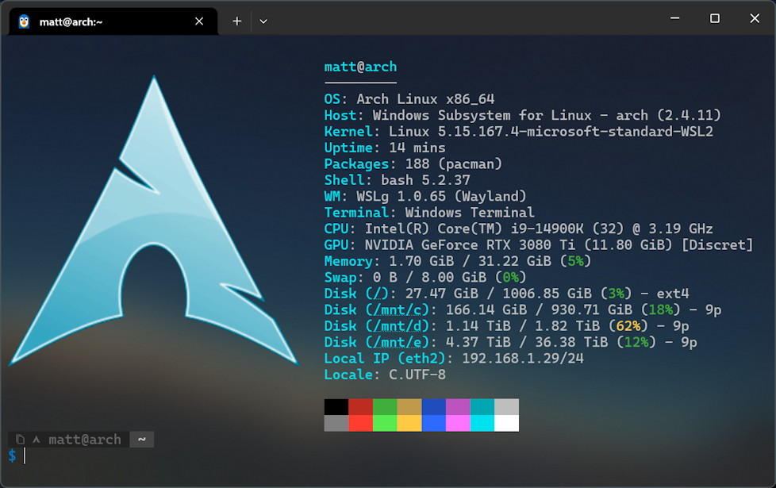

# Arch Linux on WSL
Poweshell script I use to build an Arch Linux WSL distribution from scratch.

Configures:
- Latest minimal Arch kernel-less distro
- System locale
- Non-root user with password-less sudo
- systemd
- yay package manager
- fastfetch w/ sixel logo (Requires Windows Terminal to see)
- oh-my-posh BASH prompt

## Usage
1. For systemd to work correctly, ensure you have [disabled cgroups v1 in WSL](https://github.com/spurin/wsl-cgroupsv2/blob/main/README.md) in your `$HOME\.wslconfig` file:
```ini
[wsl2]
kernelCommandLine = cgroup_no_v1=all systemd.unified_cgroup_hierarchy=1
```
2. Unzip the [archive file](https://github.com/mattzink/arch-wsl/archive/refs/heads/main.zip) from this repo
3. From a Powershell prompt, run `create-arch-distro.ps1` with desired parameters (see [the script](create-arch-distro.ps1) for all supported parameters)
```pwsh
> .\create-arch-distro.ps1 -DistroName myarch -UserName myuser -Force
```
4. If successfull, then you should be able run the distro
```pwsh
> wsl -d myarch
```
